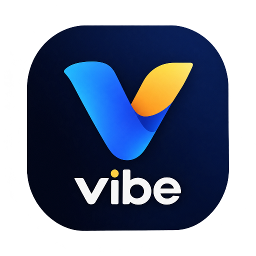

# 💜 Vibe

> **Match your mood. Meet real people. Chat live.**

Vibe is a mood-based friend matching and chat app — a Progressive Web App (PWA) built for authentic connections. Pick your mood, meet people on the same wavelength, and start conversations that matter.

---

## ✨ Features

### 🎭 Mood-Based Matching
- 6 unique moods: Happy, Sad, Party, Chill, Tired, Motivated
- Match with people who feel the same way today
- Change mood every 4 hours (max 6 times per day)

### 🏠 Social Feed
- Share text posts (up to 280 characters)
- Like and comment on posts
- Real-time updates

### 💬 Real-Time Chat
- Live messaging powered by Supabase Realtime
- Active users list (see who's online now)
- Daily chat limit: 10 conversations per day
- Chat only with people on your vibe

### 👤 Rich Profiles
- Age, gender, city, interests, bio
- Verified badges for trusted users
- Posts / About / Gifts tabs

### 🎁 Daily Gifts & Streaks
- Claim a random gift every day
- 5 rarity levels: Common, Uncommon, Rare, Epic, Legendary
- Build daily streaks for milestone rewards
- Custom SVG gift icons

### 🌙 Premium Experience
- Light / Dark / Auto theme
- Smooth animations & micro-interactions
- No emoji — 100% custom SVG icons
- Installable as PWA
- Offline support

### ⚙️ Settings
- Theme switcher
- Privacy & safety center
- Full customization

---

## 🛠️ Tech Stack

| Layer | Technology |
|-------|-----------|
| **Frontend** | HTML5, CSS3, Vanilla JavaScript |
| **Backend** | Supabase (PostgreSQL + Auth + Realtime) |
| **Hosting** | Cloudflare Pages |
| **PWA** | Service Worker + Web App Manifest |
| **Fonts** | Poppins + Inter (Google Fonts) |

---

## 📱 Screenshots

*(Coming soon — after first deploy)*

---

## 🚀 Live Demo

**Live URL:** *(Coming soon)*

---

## 🏗️ Project Structure
